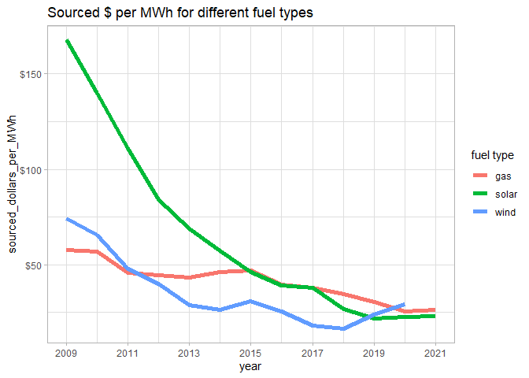

# tidytuesday_2022

My 2022 entries for "A weekly social data project in R".

## May

Getting back into it!

[2022 05 03 solar power - full source](/content/2022_05_03_solar_wind_utilities/2022_05_03_solar.md) 

## Jan - April

I did not participate. :(
