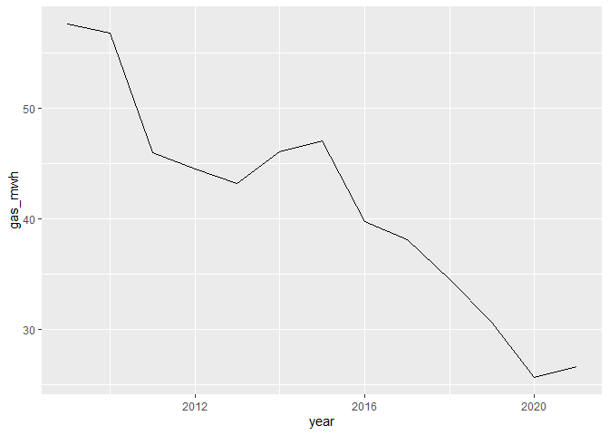
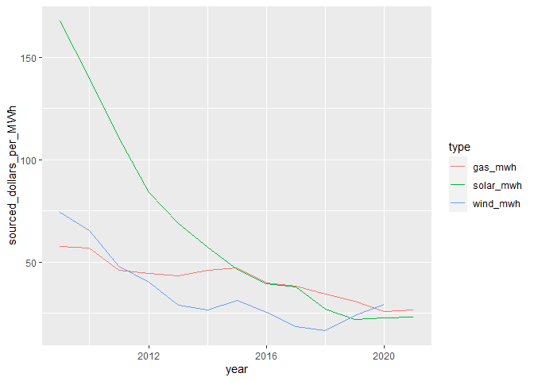

## intro

This is the May 3rd 2022 tidytuesday dataset exploration about solar power. My first tidytuesday since August 31 2021. 

## Load libraries, get data 

```r
#load libraries
library(tidytuesdayR)
library(tidyverse)

# get the data
capacity <- readr::read_csv('https://raw.githubusercontent.com/rfordatascience/tidytuesday/master/data/2022/2022-05-03/capacity.csv')
wind <- readr::read_csv('https://raw.githubusercontent.com/rfordatascience/tidytuesday/master/data/2022/2022-05-03/wind.csv')
solar <- readr::read_csv('https://raw.githubusercontent.com/rfordatascience/tidytuesday/master/data/2022/2022-05-03/solar.csv')
average_cost <- readr::read_csv('https://raw.githubusercontent.com/rfordatascience/tidytuesday/master/data/2022/2022-05-03/average_cost.csv')
```

## Explore the data

```r
# super basic line plot
average_cost %>%
  ggplot(aes(year,gas_mwh)) +
  geom_line()
```

<!-- -->

```r
# We're going to have to reshape the data
average_cost
```

```
## # A tibble: 13 x 4
##     year gas_mwh solar_mwh wind_mwh
##    <dbl>   <dbl>     <dbl>    <dbl>
##  1  2009    57.6     168.      74.3
##  2  2010    56.8     140.      65.5
##  3  2011    46.0     111.      47.8
##  4  2012    44.5      84.1     40.1
##  5  2013    43.2      68.9     28.7
##  6  2014    46.1      57.3     26.6
##  7  2015    47.1      46.3     31.2
##  8  2016    39.8      39.3     25.6
##  9  2017    38.1      37.8     18.4
## 10  2018    34.5      27.0     16.7
## 11  2019    30.7      21.9     23.8
## 12  2020    25.7      22.8     29.3
## 13  2021    26.6      23.1     NA
```


```r
average_cost %>%
  pivot_longer(
    cols = gas_mwh:wind_mwh, 
    names_to = "type", 
    values_to = "sourced_dollars_per_MWh",
    values_drop_na = TRUE) %>%
  ggplot(aes(year,sourced_dollars_per_MWh, color=type))+
  geom_line()
```

<!-- -->


