## intro

This is the May 3rd 2022 tidytuesday dataset exploration about solar power. It is my first tidytuesday since August 31 2021. I will start small by walking through some elementary steps using `R`. 

## Load libraries, get data 

```r
#load libraries
library(tidytuesdayR)
library(tidyverse)
library(lubridate)

# get the data
capacity <- readr::read_csv('https://raw.githubusercontent.com/rfordatascience/tidytuesday/master/data/2022/2022-05-03/capacity.csv')
wind <- readr::read_csv('https://raw.githubusercontent.com/rfordatascience/tidytuesday/master/data/2022/2022-05-03/wind.csv')
solar <- readr::read_csv('https://raw.githubusercontent.com/rfordatascience/tidytuesday/master/data/2022/2022-05-03/solar.csv')
average_cost <- readr::read_csv('https://raw.githubusercontent.com/rfordatascience/tidytuesday/master/data/2022/2022-05-03/average_cost.csv')
```

## Explore the data

Let's start exploring!

### average cost exploration 

First, have a look at the `average_cost` data itself. 

```r
average_cost
```

```
## # A tibble: 13 x 4
##     year gas_mwh solar_mwh wind_mwh
##    <dbl>   <dbl>     <dbl>    <dbl>
##  1  2009    57.6     168.      74.3
##  2  2010    56.8     140.      65.5
##  3  2011    46.0     111.      47.8
##  4  2012    44.5      84.1     40.1
##  5  2013    43.2      68.9     28.7
##  6  2014    46.1      57.3     26.6
##  7  2015    47.1      46.3     31.2
##  8  2016    39.8      39.3     25.6
##  9  2017    38.1      37.8     18.4
## 10  2018    34.5      27.0     16.7
## 11  2019    30.7      21.9     23.8
## 12  2020    25.7      22.8     29.3
## 13  2021    26.6      23.1     NA
```
Now make a very simple line plot.


```r
average_cost %>%
  ggplot(aes(year,gas_mwh)) +
  geom_line()
```

<!-- -->

I want to put all three quantities (gas, solar, and wind) on the same plot so that means reshaping the data to make a wide table into a long (or tall) table.


```r
average_cost_long<- average_cost %>%
  pivot_longer(
    cols = gas_mwh:wind_mwh, 
    names_to = "fuel_type", 
    values_to = "sourced_dollars_per_MWh",
    values_drop_na = TRUE) %>%
  mutate(fuel_type = str_replace_all(fuel_type,pattern="_mwh", replacement=""))

head(average_cost_long)
```

```
## # A tibble: 6 x 3
##    year fuel_type sourced_dollars_per_MWh
##   <dbl> <chr>                       <dbl>
## 1  2009 gas                          57.6
## 2  2009 solar                       168. 
## 3  2009 wind                         74.3
## 4  2010 gas                          56.8
## 5  2010 solar                       140. 
## 6  2010 wind                         65.5
```
Now, a plot with all three fuel types.

```r
average_cost_long%>%
  ggplot(aes(year,sourced_dollars_per_MWh, color=fuel_type))+
  geom_line()
```

<!-- -->

Plot cleanup. Give a title, label the axes, make the lines thicker.


```r
average_cost_long%>%
  ggplot(aes(year,sourced_dollars_per_MWh, color=fuel_type))+
  geom_line(size=2) +
  xlab("year")+
  ylab("Sourced $ per MWh")+
  ggtitle("Sourced $ per MWh for different fuel types")
```

<!-- -->

Reduce clutter by labeling the y-axis with dollar signs, removing the x axis label, and renaming `fuel_type` to `fuel type` in the legend. 


```r
average_cost_long%>%
  ggplot(aes(year,sourced_dollars_per_MWh, color=fuel_type))+
  geom_line(size=2)+
  scale_y_continuous(labels=scales::dollar_format())+
  ggtitle("Sourced $ per MWh for different fuel types")+
  theme(axis.title.x=element_blank(), 
        #axis.text.x=element_blank(),
        #axis.ticks.x=element_blank(),
        axis.title.y=element_blank(), 
        #axis.text.y=element_blank(),
        #axis.ticks.y=element_blank()
        )+
  labs(color="fuel type")
```

<!-- -->
Remove the gray background, add a marker for every year, and make the major y axis interval 25 with minor 5.


```r
average_cost_long%>%
  ggplot(aes(year,sourced_dollars_per_MWh, color=fuel_type))+
  geom_line(size=2)+
  scale_y_continuous(breaks=seq(0, 200, by=50),labels=scales::dollar_format())+
  scale_x_continuous(breaks=seq(2009, 2021, by=2))+
  ggtitle("Sourced $ per MWh for different fuel types")+
  theme(axis.title.x=element_blank(), 
        #axis.text.x=element_blank(),
        #axis.ticks.x=element_blank(),
        axis.title.y=element_blank(), 
        #axis.text.y=element_blank(),
        #axis.ticks.y=element_blank()
        )+
  labs(color="fuel type")+
  theme_light()
```

<!-- -->
## Explore the other data sets

Starting with capacity, units are in gigawatts:


```r
capacity
```

```
## # A tibble: 49 x 7
##    type   year standalone_prior hybrid_prior standalone_new hybrid_new total_gw
##    <chr> <dbl>            <dbl>        <dbl>          <dbl>      <dbl>    <dbl>
##  1 Solar  2014             25.1          0             19.5        0       44.6
##  2 Solar  2015             33.1          0             23.8        0       56.8
##  3 Solar  2016             37.0          0             83.3        0      120. 
##  4 Solar  2017             83.6          0            105.         0      189. 
##  5 Solar  2018            138.          11.6          116.        17.7    283. 
##  6 Solar  2019            156.          43.0          110.        58.6    367. 
##  7 Solar  2020            196.          96.0          108.        63.3    462. 
##  8 Wind   2014             66.7          0             29.2        0       95.9
##  9 Wind   2015             65.0          0             44.6        0      110. 
## 10 Wind   2016             74.8          0             66.9        0      142. 
## # ... with 39 more rows
```

Again, the data must be reshaped.

```r
capacity_long <- capacity %>%
  pivot_longer(
    cols=standalone_prior:hybrid_new,
    names_to = "category",
    values_to = "gigawatts",
    values_drop_na = TRUE)

capacity_long
```

```
## # A tibble: 148 x 5
##    type   year total_gw category         gigawatts
##    <chr> <dbl>    <dbl> <chr>                <dbl>
##  1 Solar  2014     44.6 standalone_prior      25.1
##  2 Solar  2014     44.6 hybrid_prior           0  
##  3 Solar  2014     44.6 standalone_new        19.5
##  4 Solar  2014     44.6 hybrid_new             0  
##  5 Solar  2015     56.8 standalone_prior      33.1
##  6 Solar  2015     56.8 hybrid_prior           0  
##  7 Solar  2015     56.8 standalone_new        23.8
##  8 Solar  2015     56.8 hybrid_new             0  
##  9 Solar  2016    120.  standalone_prior      37.0
## 10 Solar  2016    120.  hybrid_prior           0  
## # ... with 138 more rows
```

Now a quick plot, which shows that `standalone_prior` has grown while `hybrid_new` and `hybrid_prior` have increased since 2017. 


```r
capacity_long %>%
  ggplot(aes(x=year,y=gigawatts,fill=category))+
  geom_bar(position = 'dodge',stat = 'identity')
```

<!-- -->

Now let's do a side-by-side split multiple, split on new and prior.


```r
#separate(mytext, sep = " ", into = c("col1","col2"), remove = FALSE)

capacity_long_sep<- capacity_long %>%
  separate(category,sep="_",into = c("type","time"), remove = TRUE)

capacity_long_sep
```

```
## # A tibble: 148 x 5
##     year total_gw gigawatts type       time 
##    <dbl>    <dbl>     <dbl> <chr>      <chr>
##  1  2014     44.6      25.1 standalone prior
##  2  2014     44.6       0   hybrid     prior
##  3  2014     44.6      19.5 standalone new  
##  4  2014     44.6       0   hybrid     new  
##  5  2015     56.8      33.1 standalone prior
##  6  2015     56.8       0   hybrid     prior
##  7  2015     56.8      23.8 standalone new  
##  8  2015     56.8       0   hybrid     new  
##  9  2016    120.       37.0 standalone prior
## 10  2016    120.        0   hybrid     prior
## # ... with 138 more rows
```


```r
capacity_long_sep %>%
  ggplot(aes(x=year,y=gigawatts,fill=type))+
  geom_bar(position = 'dodge',stat = 'identity')+
  facet_wrap(~time)
```

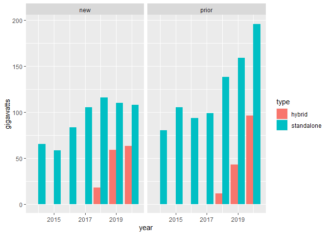<!-- -->


```r
solar
```

```
## # A tibble: 328 x 3
##    date       solar_mwh solar_capacity
##    <date>         <dbl>          <dbl>
##  1 2009-02-23      132.           30  
##  2 2009-03-01      160.           30  
##  3 2009-03-05      151.           19  
##  4 2009-05-01      210.           12.6
##  5 2009-05-08      143.          230  
##  6 2009-06-01      131.           20  
##  7 2009-06-01      202.           14  
##  8 2009-06-01      228.           10.1
##  9 2009-06-22      166.           48  
## 10 2009-08-17      146.          250  
## # ... with 318 more rows
```

A simple line graph of date and the estimated cost of megawatt per hour for solar.


```r
solar %>%
  ggplot(aes(date,solar_mwh)) +
  geom_line()
```

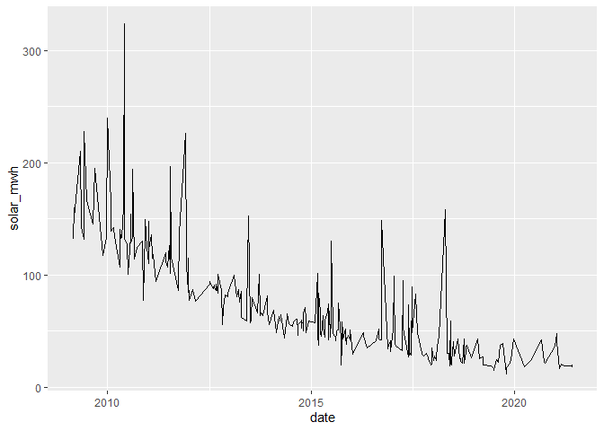<!-- -->

This data may lead itself better to dots instead.


```r
solar %>%
  ggplot(aes(date,solar_mwh)) +
  geom_point()
```

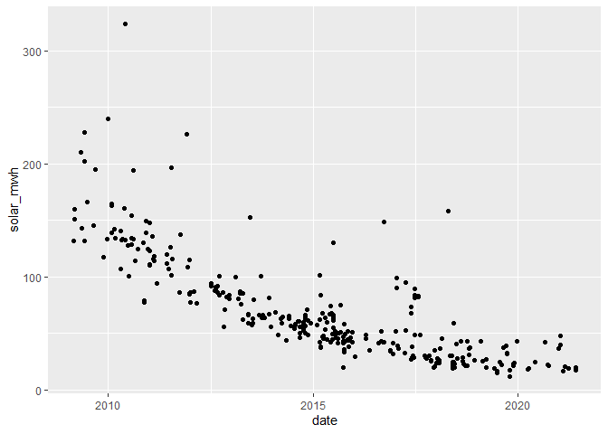<!-- -->

Visualizing solar capacity on the above graph as the size of the dot.


```r
solar %>%
  ggplot(aes(date,solar_mwh)) +
  geom_point(aes(size=solar_capacity))
```

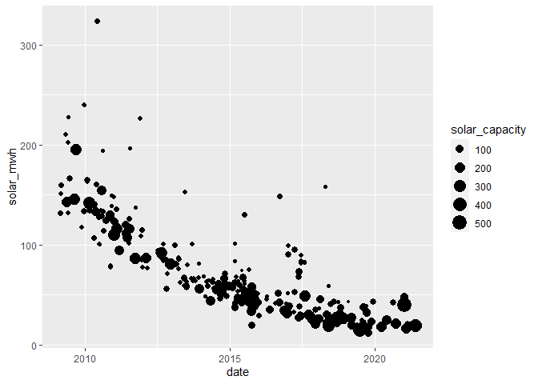<!-- -->

Some color now.


```r
solar %>%
  ggplot(aes(date,solar_mwh)) +
  geom_point(aes(size=solar_capacity, color=solar_capacity))
```

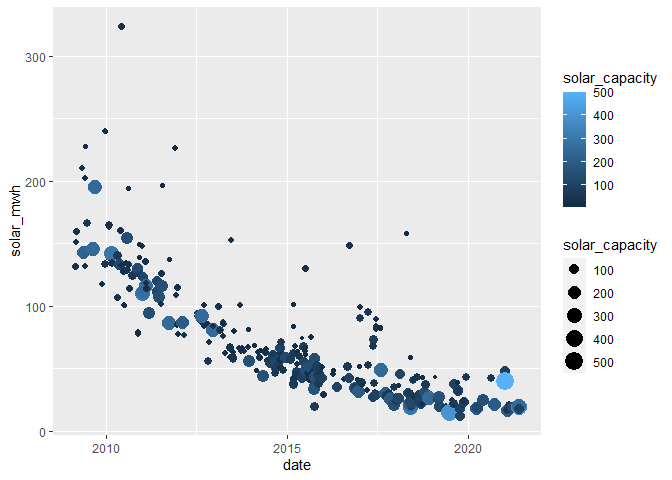<!-- -->

Too much overlap, so make the dots transparent.


```r
solar %>%
  ggplot(aes(date,solar_mwh)) +
  geom_point(aes(size=solar_capacity, color=solar_capacity, alpha=.5))+
  geom_smooth(method=loess)
```

```
## `geom_smooth()` using formula 'y ~ x'
```

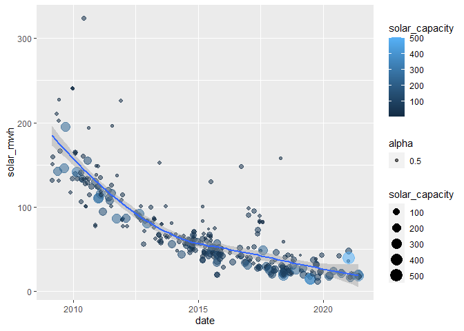<!-- -->

Change that moving average line to another color for fun.


```r
solar %>%
  ggplot(aes(date,solar_mwh)) +
  geom_point(aes(size=solar_capacity, color=solar_capacity, alpha=.5))+
  geom_smooth(method=loess,color="green", fill="red")
```

```
## `geom_smooth()` using formula 'y ~ x'
```

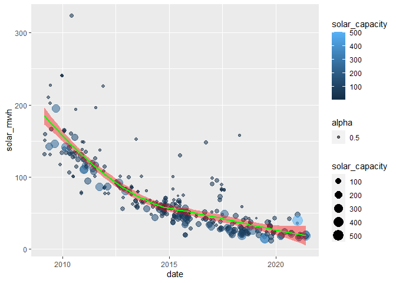<!-- -->

That's a but too much, but it looks cool. 


```r
solar %>%
  mutate(year=year(solar$date))%>%
  ggplot(aes(solar_mwh,solar_capacity))+
  geom_point(aes(alpha=.5))
```

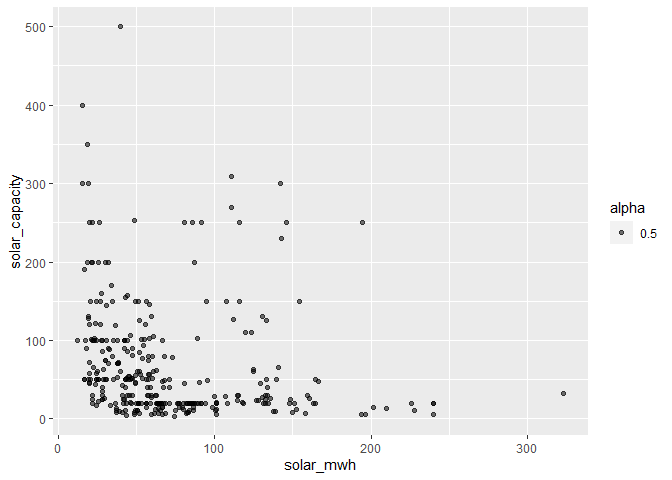<!-- -->
Take the nice dot plot with trendline (minus the colorful red trendline) and apply that to the wind dataset.


```r
wind %>%
  ggplot(aes(date,wind_mwh)) +
  geom_point(aes(size=wind_capacity, color=wind_capacity, alpha=.5))+
  geom_smooth(method=loess)
```

```
## `geom_smooth()` using formula 'y ~ x'
```

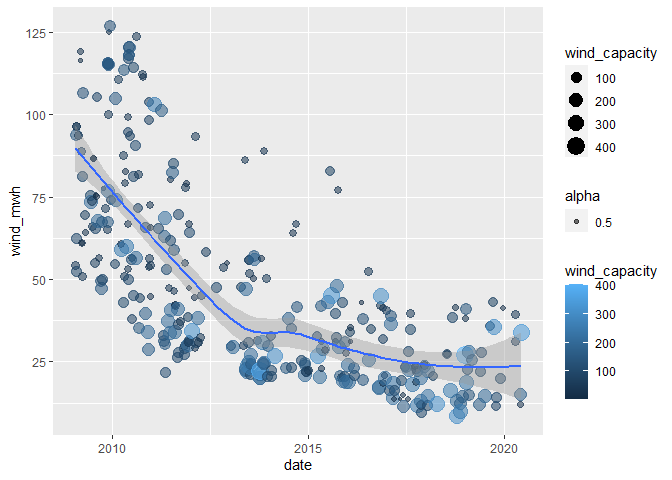<!-- -->

There must be a way to combine the `wind` and `solar` datasets.


```r
solar
```

```
## # A tibble: 328 x 3
##    date       solar_mwh solar_capacity
##    <date>         <dbl>          <dbl>
##  1 2009-02-23      132.           30  
##  2 2009-03-01      160.           30  
##  3 2009-03-05      151.           19  
##  4 2009-05-01      210.           12.6
##  5 2009-05-08      143.          230  
##  6 2009-06-01      131.           20  
##  7 2009-06-01      202.           14  
##  8 2009-06-01      228.           10.1
##  9 2009-06-22      166.           48  
## 10 2009-08-17      146.          250  
## # ... with 318 more rows
```


```r
wind
```

```
## # A tibble: 328 x 3
##    date       wind_mwh wind_capacity
##    <date>        <dbl>         <dbl>
##  1 2009-01-28     54.1          50.4
##  2 2009-01-30     62.3          98.9
##  3 2009-02-02     52.5          99  
##  4 2009-02-05     93.8         150  
##  5 2009-02-05     96.5          51  
##  6 2009-02-05     96.5          49.5
##  7 2009-02-19     93.8          49.5
##  8 2009-03-17    116.            8  
##  9 2009-03-17    119.           24.8
## 10 2009-03-24     88.8          63  
## # ... with 318 more rows
```

The dates don't match 1 to 1. Make them both long tables and then merge on dates. 


```r
wind_long <- wind %>%
  pivot_longer(
    cols = wind_mwh:wind_capacity,
    names_to = "category",
    values_to = "value",
    values_drop_na = TRUE
  )

wind_long
```

```
## # A tibble: 656 x 3
##    date       category      value
##    <date>     <chr>         <dbl>
##  1 2009-01-28 wind_mwh       54.1
##  2 2009-01-28 wind_capacity  50.4
##  3 2009-01-30 wind_mwh       62.3
##  4 2009-01-30 wind_capacity  98.9
##  5 2009-02-02 wind_mwh       52.5
##  6 2009-02-02 wind_capacity  99  
##  7 2009-02-05 wind_mwh       93.8
##  8 2009-02-05 wind_capacity 150  
##  9 2009-02-05 wind_mwh       96.5
## 10 2009-02-05 wind_capacity  51  
## # ... with 646 more rows
```


```r
solar_long <- solar %>%
  pivot_longer(
    cols = solar_mwh:solar_capacity,
    names_to = "category",
    values_to = "value",
    values_drop_na = TRUE
  )

solar_long
```

```
## # A tibble: 656 x 3
##    date       category       value
##    <date>     <chr>          <dbl>
##  1 2009-02-23 solar_mwh      132. 
##  2 2009-02-23 solar_capacity  30  
##  3 2009-03-01 solar_mwh      160. 
##  4 2009-03-01 solar_capacity  30  
##  5 2009-03-05 solar_mwh      151. 
##  6 2009-03-05 solar_capacity  19  
##  7 2009-05-01 solar_mwh      210. 
##  8 2009-05-01 solar_capacity  12.6
##  9 2009-05-08 solar_mwh      143. 
## 10 2009-05-08 solar_capacity 230  
## # ... with 646 more rows
```


```r
wind_and_solar_long <- bind_rows(wind_long,solar_long)

wind_and_solar_long
```

```
## # A tibble: 1,312 x 3
##    date       category      value
##    <date>     <chr>         <dbl>
##  1 2009-01-28 wind_mwh       54.1
##  2 2009-01-28 wind_capacity  50.4
##  3 2009-01-30 wind_mwh       62.3
##  4 2009-01-30 wind_capacity  98.9
##  5 2009-02-02 wind_mwh       52.5
##  6 2009-02-02 wind_capacity  99  
##  7 2009-02-05 wind_mwh       93.8
##  8 2009-02-05 wind_capacity 150  
##  9 2009-02-05 wind_mwh       96.5
## 10 2009-02-05 wind_capacity  51  
## # ... with 1,302 more rows
```


```r
wind_and_solar_long %>%
  ggplot(aes(date,value)) +
  geom_point(aes(color=category, alpha=.5))+
  geom_smooth(method=loess)
```

```
## `geom_smooth()` using formula 'y ~ x'
```

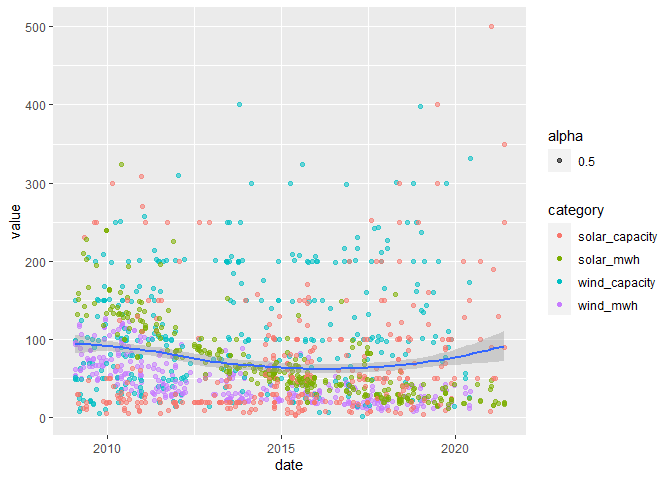<!-- -->

Nope, we need to split up category.


```r
#separate(coltosplitgoeshere, sep = " ", into = c("col1","col2",...,"coln"), remove = TRUE)

wind_and_solar_long_sep <- wind_and_solar_long %>%
  separate(category,
           sep="_",
           into= c("power source","type"),
           remove=TRUE
           )

wind_and_solar_long_sep
```

```
## # A tibble: 1,312 x 4
##    date       `power source` type     value
##    <date>     <chr>          <chr>    <dbl>
##  1 2009-01-28 wind           mwh       54.1
##  2 2009-01-28 wind           capacity  50.4
##  3 2009-01-30 wind           mwh       62.3
##  4 2009-01-30 wind           capacity  98.9
##  5 2009-02-02 wind           mwh       52.5
##  6 2009-02-02 wind           capacity  99  
##  7 2009-02-05 wind           mwh       93.8
##  8 2009-02-05 wind           capacity 150  
##  9 2009-02-05 wind           mwh       96.5
## 10 2009-02-05 wind           capacity  51  
## # ... with 1,302 more rows
```


```r
wind_and_solar_long_sep %>%
  ggplot(aes(date,value))+
  geom_point(aes(color=`power source`))+
  facet_wrap(~type)
```

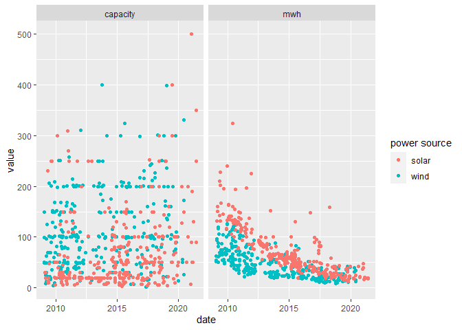<!-- -->

```r
wind_and_solar_long_sep %>%
  filter(type=="mwh") %>%
  ggplot(aes(date,value, color=`power source`))+
  geom_point(aes(alpha=.5))+
  geom_smooth()
```

```
## `geom_smooth()` using method = 'loess' and formula 'y ~ x'
```

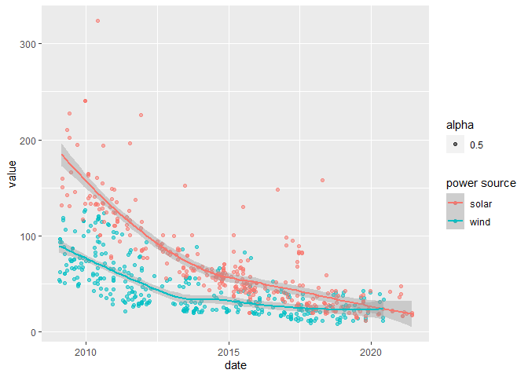<!-- -->


```r
wind_and_solar_long_sep %>%
  filter(type=="mwh") %>%
  ggplot(aes(date,value, color=`power source`))+
  geom_point()+
  geom_smooth(method=`loess`)+
  scale_y_continuous(labels=scales::dollar_format())+
  ggtitle("Cost $ per MWh")+
  xlab("")+
  ylab("")+
  theme_light()+
  theme(legend.position="top")
```

```
## `geom_smooth()` using formula 'y ~ x'
```

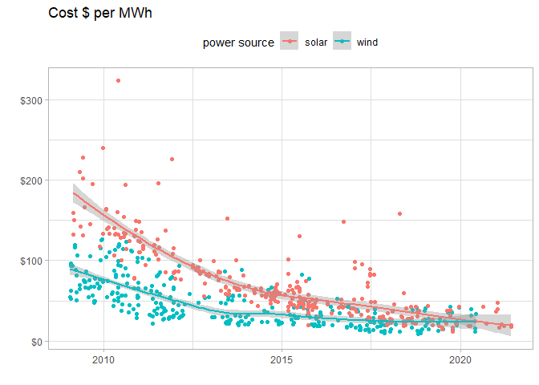<!-- -->

Aggregate the above plot by year. 


```r
wind_and_solar_long_sep %>%
  filter(type=="mwh") %>%
  mutate(year = year(date)) %>%
  mutate(month = month(date)) %>%
  ggplot(aes(x=year, y = value))+
  geom_boxplot(
    aes(group = cut_width(year,1)),
        outlier.alpha=.5)+
  facet_grid(~`power source`)+
  scale_y_continuous(
    labels=scales::dollar_format()
    )+
  geom_smooth(alpha=.2)
```

```
## `geom_smooth()` using method = 'loess' and formula 'y ~ x'
```

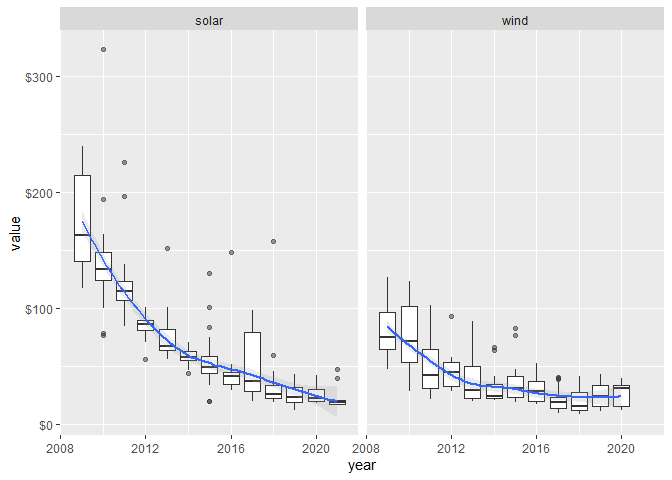<!-- -->

